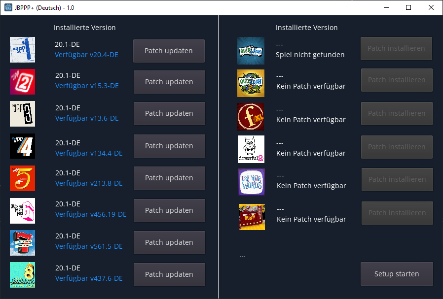

# Jackbox Party Pack Patcher (+)

Jackbox Party Pack Patcher (+) is a patch utility to quickly install community made language packs for Jackbox Party Pack Games.

## What's this?

This software can attempt to auto-detect where your Jackbox Games are installed and then offer to install community created langauge packs to alter the in-game language.
If you already installed the necessary language pack then it will instead check for updates to them and offer to install those updates.

## How to use?

Run Setup to locate your current Jackbox Installation locations, and pick your desired language.

Once the settings are saved, it will check for language pack updates and offer to install. After patching you can launch your games as normal.

## Status

It is currently in stable release.

## How to build?

You will need [Godot](https://godotengine.org/) (Originally built with 3.4-206ba70f4), the [gdunzip addon](https://github.com/jellehermsen/gdunzip) made by @jellehermsen placed in /addons/, and finally a copy of [OpenSans-Regular.ttf](https://fonts.google.com/specimen/Open+Sans) placed in /resources/

The addon and Font family were not included due to their licensing conditions.

Once gathered, open projoct.godot with Godot and create a new DynamicFont resource in /resources/ and assign it the OpenSans-Regular.ttf font. 

Then Project => Export to build.

## Screenshot(s)

## Credit

Dax [@DebugDax](https://twitter.com/debugdax)